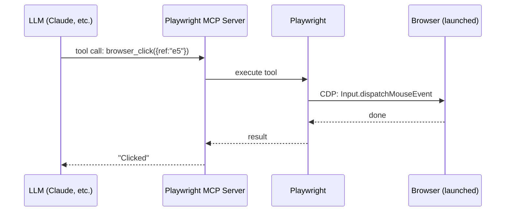
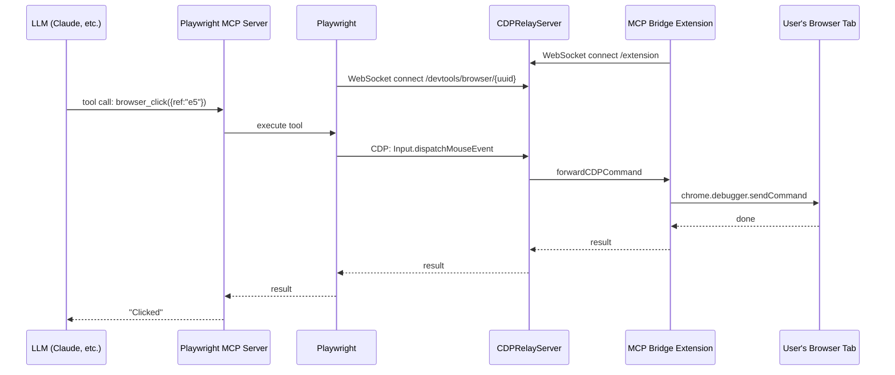
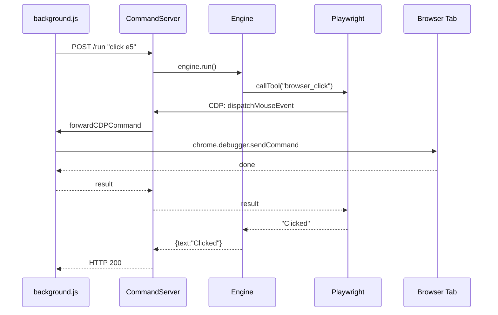

# Architecture Reference

## 1. Regular Playwright MCP

Playwright launches its own browser. Direct CDP connection.

Playwright owns the browser — talks to it directly via CDP WebSocket.

## 2. Playwright MCP with MCP Bridge Extension

Playwright can't launch the user's browser. Needs the bridge extension to relay CDP.

Same CDP messages, but relayed through the bridge because Playwright has no direct connection to the user's browser.

## 3. Our Extension (playwright-repl --extension)

Same as diagram 2, but our background.js replaces the MCP Bridge, and the user types commands instead of an LLM.

