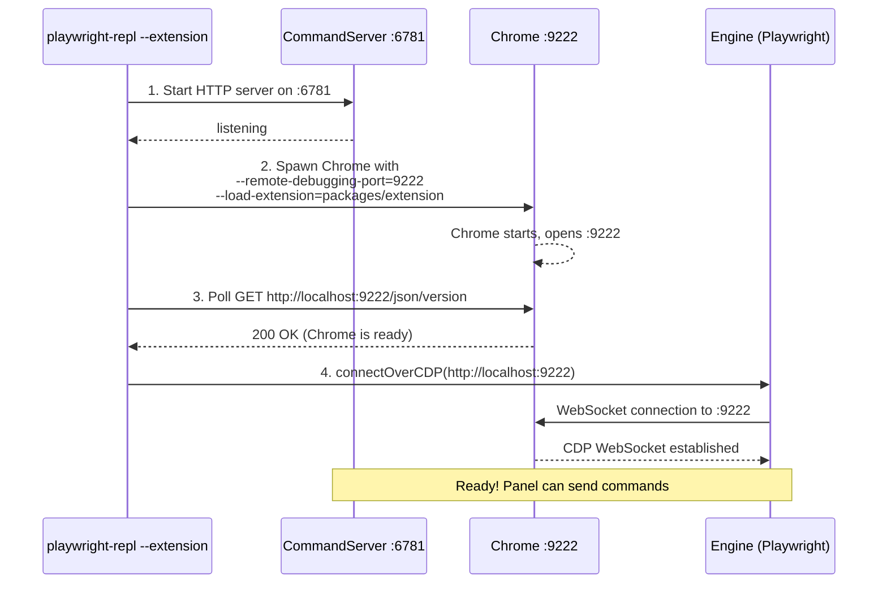
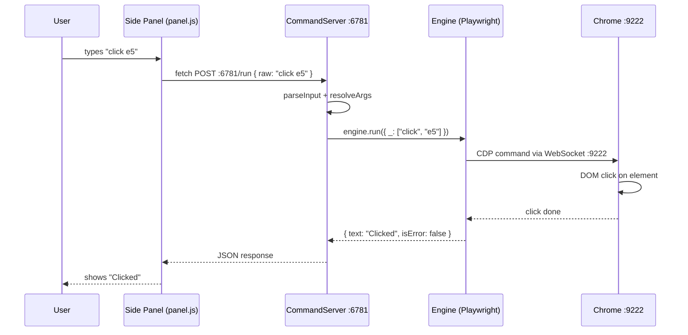

# Extension Mode v3: Side Panel + Connect via CDP

## Context

The extension needs a way to control the browser via Playwright from a side panel UI.
Two previous approaches failed:

- **v1 (CDP relay)**: WebSocket bridge through `chrome.debugger` lost lifecycle events → snapshot timeouts
- **v2 (playwright-crx)**: `crxApp.attach()` unreliable on sites with service workers → "Frame detached"

**v3 (this plan)**: Chrome launched with `--remote-debugging-port`. Engine connects via
`connectOverCDP` (full native CDP — all lifecycle events work). Extension is a **thin UI shell**
that POSTs commands to the Engine's HTTP server. No relay, no bridge, no chrome.debugger.

## High-Level Architecture

```
┌─────────────────────┐                    ┌─────────────────────┐
│       Chrome        │                    │      Node.js        │
│                     │                    │                     │
│  ┌─────────────┐    │   HTTP :6781       │  ┌───────────────┐  │
│  │ Side Panel  │----│------------------->│  │ CommandServer │  │
│  │             │<---│--------------------│--│               │  │
│  └─────────────┘    │                    │  └──────┬▲───────┘  │
│                     │                    │         ││ fn call  │
│  ┌─────────────┐    │   CDP :9222        │  ┌──────▼│───────┐  │
│  │    Tab      │<---│--------------------│--│  Playwright   │  │
│  │             │--->│--------------------│->│               │  │
│  └─────────────┘    │                    │  └───────────────┘  │
│                     │                    │                     │
└─────────────────────┘                    └─────────────────────┘
```

> **Two processes, two ports.** The side panel is just a UI — all logic runs in Node.js.
> Playwright connects directly to Chrome's CDP port — no relay, no bridge.

## Startup Sequence



## Command Sequence



## Port Allocation

Two ports needed — two **different servers** run by two **different processes**:

| Port | Who LISTENS | Who CONNECTS | Purpose |
|------|-------------|--------------|---------|
| **6781** | Our Node.js (CommandServer) | Side panel (fetch) | Panel sends REPL commands |
| **9222** | Chrome (built-in CDP) | Our Node.js (Engine) | Playwright controls the browser |

Configurable via CLI flags:
- `--port 6781` — CommandServer port (default: 6781)
- `--connect 9222` — Chrome CDP port (default: 9222)

## Command Flow

```
User types in side panel:  "click e5"
  ↓
panel.js: fetch('http://localhost:6781/run', { body: { raw: 'click e5' } })
  ↓
CommandServer: parseInput('click e5') → { _: ['click', 'e5'] }
  ↓
resolveArgs() — text locator transforms, verify commands, etc.
  ↓
engine.run({ _: ['click', 'e5'] })
  ↓
parseCommand → backend.callTool('browser_click', { ref: 'e5' })
  ↓
Playwright locator.click() → CDP :9222 → Chrome
  ↓
{ text: 'Clicked', isError: false } → panel
```

## What Changes

| Component | Before (v1 relay) | After (v3 connect) |
|-----------|-------------------|---------------------|
| Playwright → Chrome | WebSocket relay via chrome.debugger | Direct CDP via :9222 |
| background.js | CDP relay + command proxy (~150 lines) | Just `setPanelBehavior` (~5 lines) |
| panel → Engine | panel → background.js → POST /run | panel → POST /run directly |
| Chrome launch | spawn + connect.html + relay handshake | spawn with `--remote-debugging-port --load-extension` |
| Lifecycle events | Lost in relay → timeouts | Full native CDP → works |

## Files to Delete

- `packages/extension/connect.html` — relay connection UI
- `packages/extension/connect.js` — relay connection logic
- `packages/extension/lib/relayConnection.js` — CDP relay bridge
- `packages/extension/devtools.html` — DevTools panel entry
- `packages/extension/devtools.js` — DevTools panel init
- `packages/extension/content/recorder.js` — recording (defer to later)

## Steps

### Step 1: Update manifest.json → side panel

**File**: `packages/extension/manifest.json`

- Remove `"devtools_page": "devtools.html"`
- Add `"side_panel": { "default_path": "panel/panel.html" }`
- Add `"sidePanel"` to permissions
- Remove `"debugger"` from permissions
- Add `"action": {}` for icon-click → open side panel

### Step 2: Rewrite background.js (minimal)

**File**: `packages/extension/background.js`

Replace entire file (~150 lines → ~5 lines):
```js
chrome.sidePanel.setPanelBehavior({ openPanelOnActionClick: true });
```

### Step 3: Update panel.html — remove DevTools APIs

**File**: `packages/extension/panel/panel.html`

- Remove inline `<script>` that reads `chrome.devtools.inspectedWindow.tabId`
- Remove `chrome.devtools.panels.themeName` — use CSS `prefers-color-scheme` instead
- Keep all UI elements (editor, console, toolbar, input)

### Step 4: Update panel.js — fetch() instead of sendMessage

**File**: `packages/extension/panel/panel.js`

- Replace `chrome.runtime.sendMessage({ type: 'pw-command', raw })` with:
  ```js
  const res = await fetch('http://localhost:6781/run', {
    method: 'POST',
    headers: { 'Content-Type': 'application/json' },
    body: JSON.stringify({ raw: command }),
  });
  const result = await res.json();
  ```
- Remove `inspectedTabId` variable and all references
- Remove recording sendMessage calls — defer recording to later
- Remove `connectPort()` reconnection logic
- Add health check on panel load (`GET /health` → show connected/disconnected indicator)

### Step 5: Simplify Engine extension mode

**File**: `packages/core/src/engine.mjs`

Replace lines 76-141 (CDPRelayServer + relay handshake) with:
1. Start CommandServer on port 6781 (for `/run` endpoint)
2. Spawn Chrome with `--remote-debugging-port=9222` and `--load-extension=EXT_PATH`
3. Wait for Chrome CDP to be ready (poll `http://localhost:9222/json/version`)
4. Set `config.browser.cdpEndpoint = http://localhost:9222`
5. Fall through to existing connect/launch factory path (lines 142-160)

### Step 6: Simplify extension-server.mjs

**File**: `packages/core/src/extension-server.mjs`

- **Keep**: `POST /run` handler, `resolveArgs()`, `readBody()`, HTTP server, CORS headers
- **Delete**: All WebSocket code (ExtensionConnection class, CDP forwarding, relay logic)
- **Delete**: `/json/version` CDP discovery endpoint, `/relay-info` endpoint
- **Add**: `GET /health` endpoint (panel checks if server is running)

### Step 7: Delete unused extension files

Remove files listed in "Files to Delete" section above.

### Step 8: Test end-to-end

1. `playwright-repl --extension` → spawns Chrome + side panel available
2. Click extension icon → side panel opens
3. `snapshot` → returns accessibility tree
4. `click e5` → clicks element
5. `goto https://playwright.dev` → navigates
6. Verify `playwright-repl` (default mode) still works
7. Verify `playwright-repl --connect` still works

## Key Files

| File | Action |
|------|--------|
| `packages/extension/manifest.json` | Modify — DevTools panel → side panel |
| `packages/extension/background.js` | Rewrite — ~5 lines |
| `packages/extension/panel/panel.js` | Modify — sendMessage → fetch() |
| `packages/extension/panel/panel.html` | Modify — remove devtools APIs |
| `packages/core/src/engine.mjs` | Modify — extension mode uses CDP port |
| `packages/core/src/extension-server.mjs` | Simplify — remove WebSocket/relay code |

## Risks

1. **Chrome flags**: `--remote-debugging-port` + `--load-extension` together — standard flags, should work
2. **CORS**: Side panel fetching localhost:6781 — CommandServer already sets `Access-Control-Allow-Origin: *`
3. **Existing tests**: `packages/extension/test/` tests the old relay — will need updating

## Backlog

- ~~**Resizable editor/REPL areas**~~: Done — drag handle splitter already implemented in panel.js/panel.html.
- ~~**Autocompletion**~~: Done — ghost text + dropdown autocomplete already implemented in panel.js.
- **Configurable port in side panel**: Allow users to configure the CommandServer port (default 6781) from the extension's side panel UI. Store in `chrome.storage.local` for persistence. Show a settings icon/gear in the panel toolbar that opens a port input field.
- **Lighter background theme**: Current panel background is too dark — switch to a lighter color scheme as default.
- **Optional port number**: Make `--port` optional for `--extension` mode — auto-find an available port if not specified, and print the chosen port so the user can configure the side panel.
- **Optional browser spawning**: Make Chrome spawning optional in `--extension` mode. Allow users to start Chrome themselves (with `--remote-debugging-port`) and have the engine just connect to it. Use a flag like `--no-spawn` to skip Chrome launch.
- **Configurable CDP port**: Make the remote debugging port configurable via a CLI flag (e.g., `--cdp-port <number>`) instead of hardcoded 9222. Default remains 9222.
- **Handle existing Chrome profile conflict**: When `--extension` spawns Chrome with a profile that's already running, Chrome reuses the existing instance (which lacks `--remote-debugging-port`). Detect this case and warn the user, or automatically fall back to `--no-spawn` + prompt them to restart Chrome with the debugging flag.
- **DevTools panel option** *(low priority, optional)*: Support opening the panel as a DevTools panel (in addition to side panel) for users who prefer it docked in DevTools. Would require adding back `devtools.html` + `devtools.js` as an alternative entry point pointing to the same `panel.html`.
